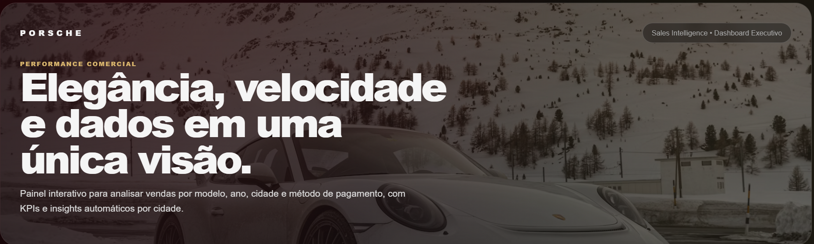

# 🚗 Porsche Sales Intelligence Dashboard

---


---
# 📌 Sobre o Projeto

Dashboard executiva inspirada na identidade visual da Porsche para análise de vendas de veículos.

O projeto foi desenvolvido utilizando HTML, CSS e JavaScript com foco em Business Intelligence, visualização de dados e experiência premium do usuário.

Permite analisar vendas por:

* Modelo Porsche
* Ano do veículo
* Cidade
* Método de pagamento
* Período de vendas

---

<p align="center">
  
</p>

<p align="center">


</p>

---

# ✨ Funcionalidades

✅ Dashboard Responsiva

✅ KPIs Executivos

✅ Receita Total

✅ Ticket Médio

✅ Ranking por Cidade

✅ Modelos Mais Vendidos

✅ Filtros Dinâmicos

✅ Insights Automáticos

✅ Interface Inspirada na Porsche

---

# 📊 Indicadores de Negócio

### Principais modelos vendidos por cidade

Identifica quais modelos apresentam maior volume de vendas em cada região.

### Ano do modelo mais vendido

Permite avaliar tendências de mercado e comportamento dos consumidores.

### Receita total

Mostra o faturamento consolidado dos veículos vendidos.

### Ticket médio

Calcula o valor médio por venda realizada.

### Insights automáticos

Geração automática de observações estratégicas a partir dos filtros selecionados.

---

# 🏗️ Estrutura do Projeto

```text
dashboard-porsche-sales/
│
├── index.html
├── README.md
│
├── css/
│   └── style.css
│
├── js/
│   └── script.js
│
├── data/
│   └── porsche_sales.csv
│
├── assets/
│   └── imagens/
│       ├── capa-dashboard.png
│       └── porsche-logo.png
│
└── docs/
    └── preview.png
```

---

# 🚀 Tecnologias Utilizadas

* HTML5
* CSS3
* JavaScript
* GitHub Pages
* Data Analytics
* Business Intelligence
* Dashboard Design
* UX/UI

---

# 🎯 Objetivos do Projeto

* Praticar desenvolvimento Front-End
* Construir dashboards executivas
* Aplicar conceitos de Business Intelligence
* Trabalhar com filtros dinâmicos
* Desenvolver portfólio para áreas de Dados e Engenharia de Software

---


---

# 🌐 Publicação

O projeto pode ser publicado utilizando GitHub Pages.

Exemplo:

```text
https://ronaldo94-github.github.io/dashboard-porsche-sales/
```

---

# 👨‍💻 Autor

### Ronaldo Augusto Sabino


### Contato

📧 [ronaldosabino94@hotmail.com](mailto:ronaldosabino94@hotmail.com)

💼 LinkedIn:
https://www.linkedin.com/in/ronaldo-a-sabino-381a07213

🐙 GitHub:
https://github.com/ronaldo94-github

---

## ⭐ Projeto desenvolvido para fins educacionais e demonstração de habilidades em Data Analytics, Business Intelligence e Desenvolvimento Web.
